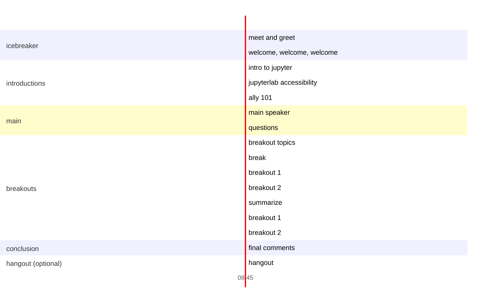

#  entertaining group learning experience about accessibility and disability

## October 2

A friendly affair that brings Jupyter and PyData community members together with accessibility experts. 

### Takeaways

Jupyter and PyData members will leave better informed and more empathetic to accessibility considerations in their work while the accessibility community will become familiar with Jupyter, and its open source challenges.

### Schedule

* Enter in breakout rooms (like you're about to go on an amusement park ride)
* Welcome, welcome, welcome
    * Set goals
* Intro to Jupyter
* Jupyterlab accessibility
* Accessibility 101
* Main speaker
* Break
* Breakouts
* Wrap up
* Hangout/cooldown (optional)

### notes

* it would be good to have a11y questions ahead of time and answer them
