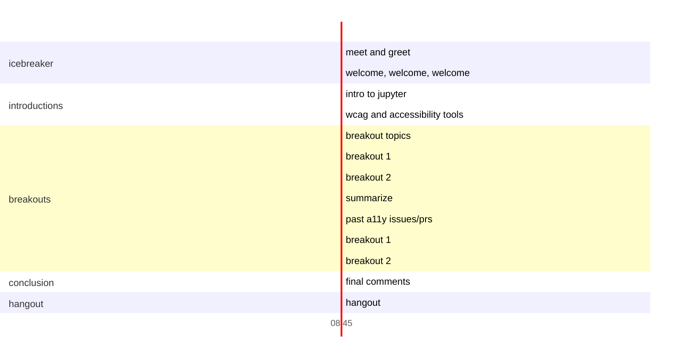

# Mentored sprint agenda
This event is held one to two weeks following our accessibility learning 
experience.

## October 9

A hands-on event focused on improvements to the Jupyter code bases and documentation accessibility conditions.

### Takeaways

Attendees will become familiar with the different skills needed to impact the Jupyter ecosystem, especially around documentation and alt text.

### Pre-event
In order to participate in the sprint, attendees will need a GitHub account. No other knowledge of git or GitHub is required.

### Schedule

* Enter in breakout rooms (like you about to go on an amusement park ride)
* Welcome, welcome, welcome
* Intro to jupyter
* Intro to accessibility tools (WAVE, JAWS, NVDA)
    * Demo tools on documentation to show the problem (and solution?)
* Breakout topics
    * Writing alt text for [Project Jupyter documentation](https://jupyter.readthedocs.io/en/latest/) or other Jupyter ecosystem documentation (no git knowledge needed)
    * Adding automated tests ([pa11y](https://pa11y.org/) and/or [Lighthouse](https://developers.google.com/web/tools/lighthouse/) to Project Jupyter documentation)
* Breakouts
    * Work on your chosen topic with smaller group
* Break
* A look at past accessibility PRs (community member)
* Breakouts
* Closing 
* Hangout/cool down (optional)

### notes

* work off forks to reduce noise.