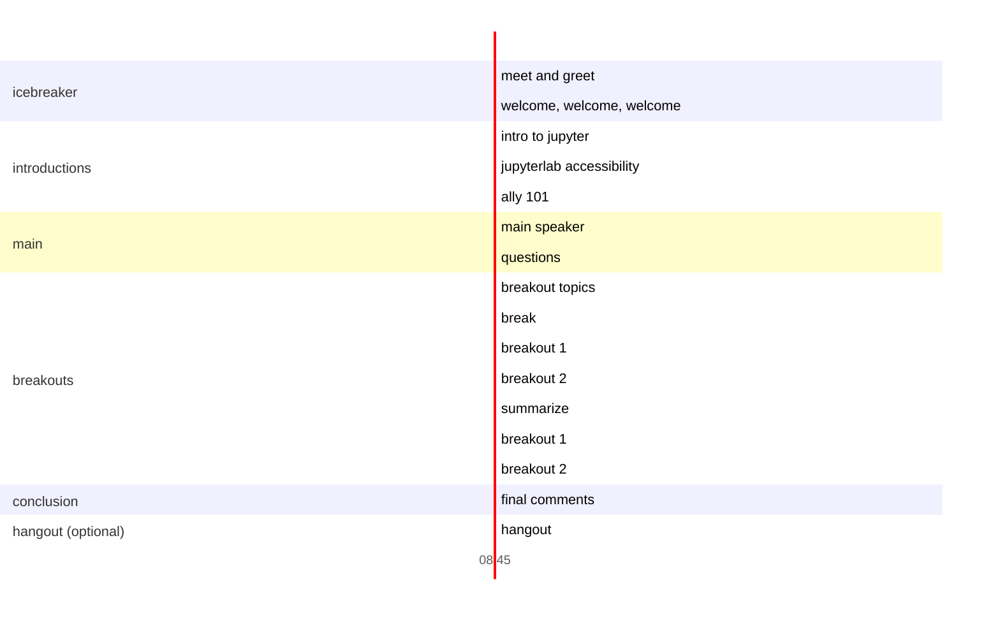

#  Jupyter Accessibility Workshops with Frank Elvasky: How to build inclusive data representations

## Event details

Date: January 15, 2022

Overview: A friendly virtual event that brings Jupyter and PyData community members together to learn from an accessibility expert. 

Join in: [sign up](https://docs.google.com/forms/d/e/1FAIpQLSf0IgPYgf0di8eM6HP1qbqduPTeGEFadXZRSIDYEXlEOgA_bw/viewform?usp=sf_link) for an invitation.

## Takeaways

Jupyter and PyData members will leave better informed and more empathetic to accessibility considerations in their work while the accessibility community will become familiar with Jupyter and its open-source challenges.

## What you need to participate

* Some familiarity with data/visualization skills

That's it! No prior experience with accessibility is required. Newcomers are welcome.

## Schedule

* Enter in breakout rooms (like you're about to go on an amusement park ride)
* Welcome and set goals
    * To educate and introduce the Jupyter community to accessibility concerns 
    in software.
    * Connect the Jupyter community to accessibility experts and disabled 
    people.
    * Learn about web content accessibility through expert content and group 
    discussions.
* Reframing accessibility within the Jupyter ecosystem
    * How accessible or inaccessible is the ecosystem now?
    * Thinking about the many types of work produced in the ecosystem: guidelines, documents, interfaces, documentation, and events.
* Main speaker
    * Frank Elavsky of [Chartability](https://chartability.fizz.studio/) on how to build inclusive data representations
* Break
* Discussion breakout rooms
    * This is a chance for attendees to reflect on what they've learned and share their own knowledge
        * How could these principles become a standard consideration in Jupyter tools? Could include guidelines, infrastructure, documentation, interface changes, etc.
        * What new questions do you have? What would you want to learn more about this topic?
* Wrap up
    * Upcoming events
    * How to stay up-to-date with accessibility efforts in Jupyter
    * Please fill out the [feedback survey](https://docs.google.com/forms/d/e/1FAIpQLSe7oMTwfLZfntqh9p8Npfsd9-o4jhSaVjhMNuuVMen8RmG3Ow/viewform?usp=sf_link) so we make sure these events are helpful and fun for the community!
* Hangout/cooldown (optional)

## Further reading

Resources for people interested in learning more about accessibility outside 
the event.

* [Chartability](https://chartability.fizz.studio/)
* [Not so short note on aria-label usage](https://html5accessibility.com/stuff/2020/11/07/not-so-short-note-on-aria-label-usage-big-table-edition/)
* [Resources For Building Accessible Tables](https://www.digitala11y.com/resources-for-building-accessible-tables/)
* [pydata-sphinx-theme #294 Add pa11y testing and reporting](https://github.com/pydata/pydata-sphinx-theme/pull/294#issuecomment-907404315)
* [ 18F Accessibility Guide Checklist](https://accessibility.18f.gov/checklist/)
* [Maintainers Summit at PyCon US 2021 - Building Accessibility into Open Source Projects: Thibaud Colas](https://youtu.be/9XI-8ZvU2w0)
* [Accessible icon links](https://kittygiraudel.com/2020/12/10/accessible-icon-links/)
* [A guide to designing accessible, WCAG-compliant focus indicators ](https://www.sarasoueidan.com/blog/focus-indicators/)