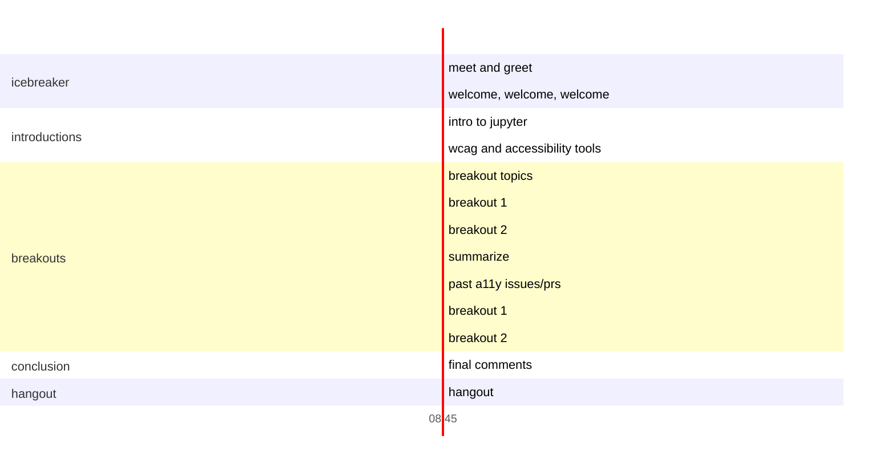

#  Jupyter Accessibility Workshops: Writing image descriptions for documentation

This event is held one to two weeks following our accessibility learning 
experience.

## Event details

Date: January 22, 2022

Overview: A hands-on event focused on improvements to the Jupyter code bases and 
documentation accessibility.

## Takeaways

Attendees will become familiar with the different skills needed to provide a 
better experience for disabled scientists in the Jupyter ecosystem, especially 
around documentation and alt text (a common type of image description).

## What you need to participate

* In order to participate in the sprint, attendees will need a GitHub account. 
No other knowledge of git or GitHub is required.
    * [Create a free GitHub account here](https://github.com/join). You can find [help for creating an account on WikiHow](https://www.wikihow.com/Create-an-Account-on-GitHub).    

## Schedule

* Enter in breakout rooms (like you about to go on an amusement park ride)
* Welcome, welcome, welcome
* Intro to Jupyter
* Intro to accessibility tools (WAVE, JAWS, NVDA)
    * Demo tools on documentation to show the problem (and solution?)
* Breakout topics
    * Writing alt text for [Project Jupyter documentation](https://jupyter.readthedocs.io/en/latest/) 
    or other Jupyter ecosystem documentation (no git knowledge needed)
    * Adding automated tests ([pa11y](https://pa11y.org/) and/or 
    [Lighthouse](https://developers.google.com/web/tools/lighthouse/) to 
    Project Jupyter documentation)
* Breakouts
    * Work on your chosen topic with a smaller group
* Break
* Breakouts
    * Continue working on your chosen topic
    * Depending on the work done, this may also be a good time to review each other's efforts and leave feedback.
* Closing 
    *  Quantify the work that's been done! Number of images and/or contributors for a commit for the alt text room. Decisions made or experiments from the testing room.
    * Vote on favorite alt text from the event (for credit on the Jupyter alt text hall of fame)
* Wrap up
    * Upcoming events
    * How to stay up-to-date with accessibility efforts in Jupyter
    * Please fill out the feedback survey so we make sure these events are helpful and fun for the community!
* Hangout/cooldown (optional)

## Further reading

Resources for people interested in learning more about accessibility outside 
the event.

* [W3's Alt decision tree](https://www.w3.org/WAI/tutorials/images/decision-tree/) (What kind of alt text does this image need?)
* [WebAim's overview of alt text](https://webaim.org/techniques/alttext/) (What is alt text and what does it need to do?)
* [Diagram Center's standards for alt text for graphs and charts](http://diagramcenter.org/table-of-contents-2.html#toc) (How do I describe images with a lot of data?)
* [Alt text style guide for Jupyter accessibility workshops](https://github.com/Quansight-Labs/jupyter-accessibility-workshops/blob/fd1d7f96ca40943eda050a339ba64bcf16dd638a/docs/alt-text-guide.md)
* [ipython/ipython #12864 Allow specifying alt text for IPython.display.Image](https://github.com/ipython/ipython/pull/12864)