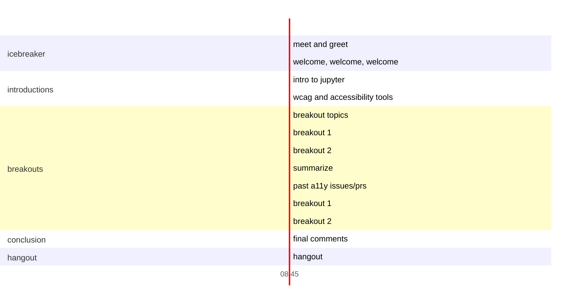

#  Jupyter Accessibility Workshops: Writing image descriptions for documentation

## Event details

Date: January 22, 2022

Overview: A hands-on event focused on improvements to the Jupyter code bases and 
documentation accessibility.

## Takeaways

Attendees will become familiar with the different skills needed to provide a 
better experience for disabled scientists in the Jupyter ecosystem, especially 
around documentation and alt text (a common type of image description).

## What you need to participate

* In order to participate in the sprint, attendees will need a GitHub account. 
No other knowledge of git or GitHub is required.
    * [Create a free GitHub account here](https://github.com/join). You can find [help for creating an account on WikiHow](https://www.wikihow.com/Create-an-Account-on-GitHub).    

That's it! No prior experience with accessibility is required. Newcomers are welcome.

## Schedule

* Enter in breakout rooms (like you about to go on an amusement park ride)
* Welcome, welcome, welcome
* Intro to Jupyter
* Intro to accessibility tools (WAVE, JAWS, NVDA)
    * Demo tools on documentation to show the problem (and solution?)
* Breakout topics
    * Writing alt text for [Project Jupyter documentation](https://jupyter.readthedocs.io/en/latest/) 
    or other Jupyter ecosystem documentation (no git knowledge needed)
    * Optional (depending on number of attendees and interest): Adding automated tests ([pa11y](https://pa11y.org/) and/or 
    [Lighthouse](https://developers.google.com/web/tools/lighthouse/) to 
    Project Jupyter documentation)
* Breakouts
    * Work on your chosen topic with a smaller group
* Break
* Breakouts
    * Continue working on your chosen topic
    * Depending on the work done, this may also be a good time to review each other's efforts and leave feedback.
    * Note any alt text you think is particularly well written in [the alt text hall of fame issue](https://github.com/Quansight-Labs/jupyter-accessibility-workshops/issues/9)
* Closing 
    *  Quantify the work that's been done! Number of images and/or contributors for a commit for the alt text room. Decisions made or experiments from the testing room.
    * Vote on favorite alt text from the event (for credit on our alt text hall of fame)
* Wrap up
    * Upcoming events
    * How to stay up-to-date with accessibility efforts in Jupyter
    * Please fill out the [feedback survey]() so we make sure these events are helpful and fun for the community!
* Hangout/cooldown (optional)

## How to participate in writing alt text

### Links needed
- [The collaborative event PR] (will be added closer to event)
- [Step by Step Images: How to Add Alt-text with Github Suggestions](https://hackmd.io/@marslee/BksnYfWVK)

### Step by step

1. Go to [our working PR] (will be added closer to event) and review the list of files needing alt text.
2. Comment on the PR which file you plan to work on. You can work as a team if desired!
3. Write alt text for an image.
4. Submit that alt text on the PR via a single-comment suggestion. [Step by Step Images: How to Add Alt-text with Github Suggestions](https://hackmd.io/@marslee/BksnYfWVK). 

**Note:** If there is an image you want to add alt text to that is not yet in the PR, tell the PR and they can add it.

6. Repeat steps 2 through 4 as much as you'd like. Be sure to coordinate with others to cover as much of the blog as we can.
7. **Optional:** If you want, you can team up with other participants and give feedback on each others' alt text.
8. You did it! Great work! 

### Alt text review

- [A basic formatting review checklist with JupyterLab notes](https://github.com/Quansight-Labs/jupyter-accessibility-workshops/blob/main/docs/alt-text-guide.md#checklist-for-alt-text-review)
- [A more general style guide for writing alt text](https://github.com/Quansight-Labs/jupyter-accessibility-workshops/blob/main/docs/alt-text-guide.md#checklist-for-alt-text-review)

## Further reading

Resources for people interested in learning more about accessibility outside 
the event.

* [W3's Alt decision tree](https://www.w3.org/WAI/tutorials/images/decision-tree/) (What kind of alt text does this image need?)
* [WebAim's overview of alt text](https://webaim.org/techniques/alttext/) (What is alt text and what does it need to do?)
* [Diagram Center's standards for alt text for graphs and charts](http://diagramcenter.org/table-of-contents-2.html#toc) (How do I describe images with a lot of data?)
* [Alt text style guide for Jupyter accessibility workshops](https://github.com/Quansight-Labs/jupyter-accessibility-workshops/blob/fd1d7f96ca40943eda050a339ba64bcf16dd638a/docs/alt-text-guide.md)
* [ipython/ipython #12864 Allow specifying alt text for IPython.display.Image](https://github.com/ipython/ipython/pull/12864)